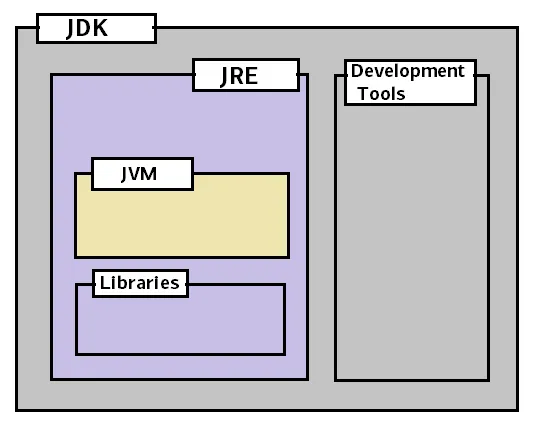

# core_java

✅ **What is Java?** <br>
Java is a high-level, object-oriented, and platform-independent programming language developed by Sun Microsystems in 1995. It is widely used to build web applications, desktop applications, mobile apps, enterprise software, and more. <br>

Java’s tagline is “Write Once, Run Anywhere” — meaning that Java code written on one platform can run on any other platform that supports Java without needing to be recompiled.

<hr>

✅ **Key Features of Java**
```ssh

| Feature                  | Description                                                                 |
| ------------------------ | --------------------------------------------------------------------------- |
|   Simple                 | Easy to learn, syntax similar to C/C++                                      |
|   Object-Oriented        | Based on real-world objects and concepts like inheritance and polymorphism  |
|   Platform Independent   | Java code runs on any OS using JVM (Java Virtual Machine)                   |
|   Secure                 | Provides runtime checking and no pointer manipulation                       |
|   Robust                 | Strong memory management and exception handling                             |
|   Multithreaded          | Supports concurrent execution of two or more threads                        |
|   High Performance       | Bytecode is optimized and executed by the JVM                               |
|   Distributed            | Supports distributed computing via networking packages (e.g., RMI, sockets) |
|   Portable               | Java programs can be moved easily from one system to another                |

```

<hr>

✅ **Java Architecture** <br> 
 1. Java Source Code (.java) → Written by the programmer  <br>
 2. Compiler (javac) → Converts source code to bytecode (.class) <br>
 3. Java Virtual Machine (JVM) → Executes the bytecode on any platform <br>

<hr>

✅ **Components of Java** <br>

 <br>

```ssh
JDK = JRE + development tools
JRE = JVM + libraries
JVM = runs the code
```

🔹 *JDK (Java Development Kit)* <br>
  **What it is :** The full toolkit for Java developers. <br>
  **Function :** Lets you write, compile, and run Java code. <br>

🔹 *JRE (Java Runtime Environment)* <br>
  **What it is :** The runtime needed to run Java applications. <br>
  **Function :** Runs already compiled Java programs (you can’t compile Java code with just the JRE). <br>

🔹 *JVM (Java Virtual Machine)* <br>
  **What it is :** A virtual machine that runs Java bytecode. <br>
  **Function :** It interprets or compiles .class files (bytecode) into machine code for your specific OS and hardware. <br>
  
<hr>

✅ **1. OOPs Concepts (Object-Oriented Programming)**
➤ **Class:**
A class is a blueprint or template that defines properties (fields) and behaviors (methods) of an object.
```ssh
class Car {
   String color;
   void drive() {
     System.out.println("Driving...");
   }
}
```

➤ **Object:**
An object is an instance of a class. It occupies memory and has state and behavior.
```ssh
Car myCar = new Car();
```

➤ **Inheritance:**
Allows one class (child) to inherit fields and methods from another class (parent).
```ssh
class Animal {
  void sound() { System.out.println("Animal Sound"); }
}
class Dog extends Animal {
  void bark() { System.out.println("Bark"); }
}
```

➤ **Polymorphism:**
Means "many forms". A method behaves differently based on the context.
 - Compile-time: Method Overloading
 - Runtime: Method Overriding

➤ **Encapsulation:**
Hides internal data using private access and exposes via public methods (getters/setters).
```ssh
class Person {
  private int age;
  public void setAge(int a) { age = a; }
  public int getAge() { return age; }
}
```

➤ **Abstraction:**
Hides complex implementation details and shows only necessary parts using abstract classes or interfaces.

<hr>

✅ **2. Data Types in Java** <br>
➤ **Primitive Types :**
int, float, char, double, byte, short, long, boolean
```ssh
int x = 10;
char c = 'A';
```

➤ **Non-Primitive Types :**
Arrays, Strings, Classes, Interfaces
```ssh
String name = "Java";
```

<hr>

✅ **3. Control Statements**  <br>
➤ **Conditional :**  if, else, switch - decision making
```ssh
if (a > b) { System.out.println("A is greater"); }
```

➤ **Loops :**  for, while, do-while - to repeat code
```ssh
for (int i = 0; i < 5; i++) {
  System.out.println(i);
}
```

➤ **Jumping :**  break, continue, return
```ssh
for (int i = 0; i < 10; i++) {
  if (i == 5) break;
}
```

<hr>

✅ **4. Access Modifiers**  <br>
Control visibility of classes and members:
```ssh
| Modifier    | Class | Package | Subclass | World |
| ----------- | ----- | ------- | -------- | ----- |
| private     | ✅    | ❌     | ❌       | ❌   |
| (default)   | ✅    | ✅     | ❌       | ❌   |
| protected   | ✅    | ✅     | ✅       | ❌   |
| public      | ✅    | ✅     | ✅       | ✅   |
```

<hr>

✅ **5. Important Java Keywords**  <br>

*this*   - Refers to current object <br>
*super*  - Refers to parent class <br>
*final*  - Prevents change (variable), override (method), or inheritance (class) <br>
*static* - Belongs to class, not object <br>
*abstract* - Used to declare abstract class/method <br>
*synchronized* - Ensures thread safety <br>

<hr>

✅ **6. Exception Handling**  <br>
➤ **What is an Exception?** <br>
An error that occurs at runtime and disrupts program flow.

➤ **Syntax:**
```ssh
try {
  int a = 5/0;
} catch (ArithmeticException e) {
  System.out.println("Can't divide by zero");
} finally {
  System.out.println("Always executed");
}
```

*throw :* to throw a custom exception <br>
*throws :* declares exceptions in method signature <br>

<hr>

✅ **7. Collections Framework**  <br>
Helps in storing, manipulating, and retrieving data efficiently.

```ssh
| Interface | Implementations                 |
| --------- | ------------------------------- |
| List      | ArrayList, LinkedList, Vector   |
| Set       | HashSet, TreeSet                |
| Map       | HashMap, TreeMap, LinkedHashMap |
```

➤ **Example:** <br>

```ssh
List<String> list = new ArrayList<>();
list.add("Apple");
```

<hr>

✅ **8. Multithreading** <br>
Allows concurrent execution of two or more threads (lightweight processes). <br>
➤ *Ways to create thread:* <br>
 - Extending Thread class
 - Implementing Runnable interface

```ssh
class MyThread extends Thread {
  public void run() {
    System.out.println("Thread Running");
  }
}
```
➤ *Methods:*
 - start(), run(), sleep(), join(), wait(), notify()


<hr>

